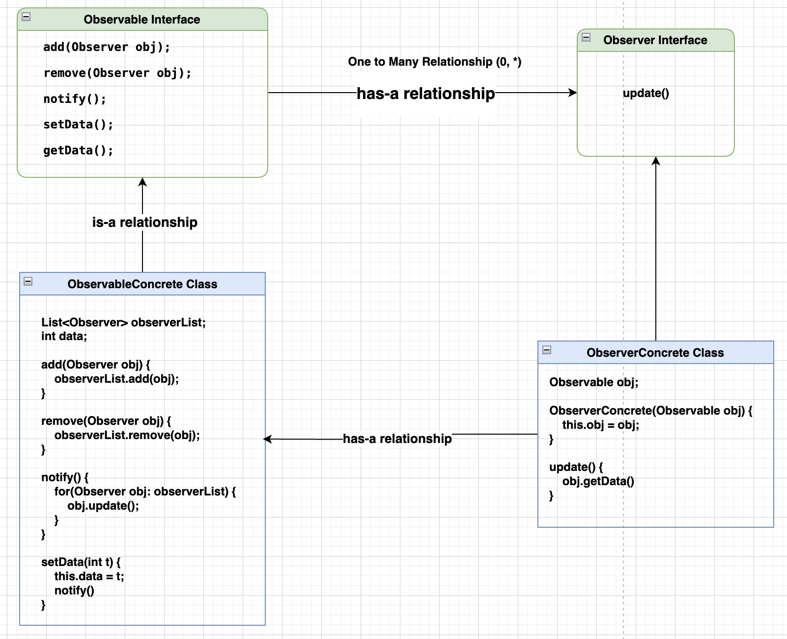

**Observer Design Pattern**

The `Observer Design Pattern` is a behavioral design pattern in Java that allows an object, called the subject, to maintain a list of dependents, called observers, and notify them automatically of any state changes. It is commonly used in scenarios where multiple objects need to be updated when a single object's state changes.

**Key Components**
- `Subject (Observable)`: The object being observed. It maintains a list of its dependents (observers) and notifies them of any state changes.
- `Observers`: These are the objects that watch the subject and get notified when there is a change in the subject's state.

**Intent**
- Defines a one-to-many dependency between objects so that when one object changes state, all its dependents are notified and updated automatically.

**Structure**
- `Subject`: Interface or class with methods to attach/detach observers and notify them.
- `Observer`: Interface with an update() method that gets called when the subject's state changes.