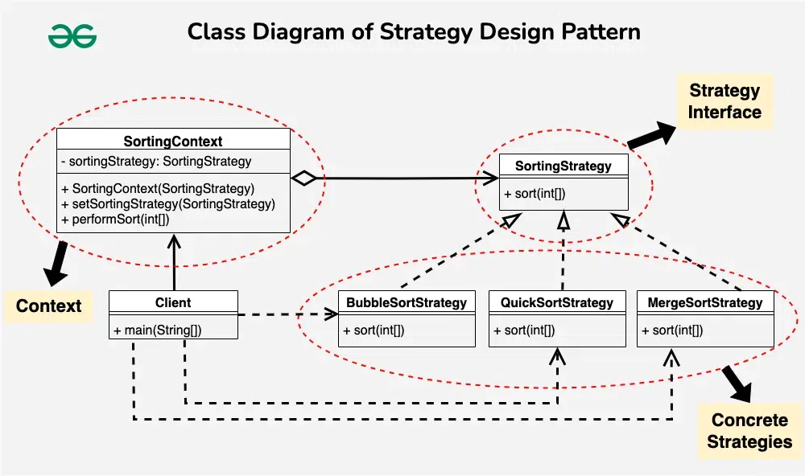

**Strategy Design Pattern**

The `Strategy Design Pattern` is a behavioral design pattern that enables selecting an algorithm's behavior at runtime. The strategy pattern defines a family of algorithms, encapsulates each one of them, and makes them interchangeable. The key idea is to allow a client to choose which algorithm to use without changing the client code.

**Key Concepts of the Strategy Pattern:**
1. **Strategy**: An interface or abstract class that defines a family of interchangeable algorithms or behaviors.
2. **Concrete Strategies**: Implementations of the `Strategy` interface that encapsulate different algorithms or behaviors.
3. **Context**: The class that uses a `Strategy` object to execute the behavior. It holds a reference to a `Strategy` and delegates the algorithm’s execution to the `Strategy`.

**When to Use the Strategy Pattern:**
- When you have multiple algorithms for a specific task and want to switch between them at runtime.
- When you want to eliminate conditional statements like `if-else` or `switch` by encapsulating the algorithms in different classes.
- When you want to make your code more flexible, reusable, and maintainable by keeping algorithm logic separate from the client code.

**Strategy Design Pattern Example:**
Let’s consider a sorting application where we need to sort a list of integers. However, the sorting algorithm to be used may vary depending on factors such as the size of the list and the desired performance characteristics.

