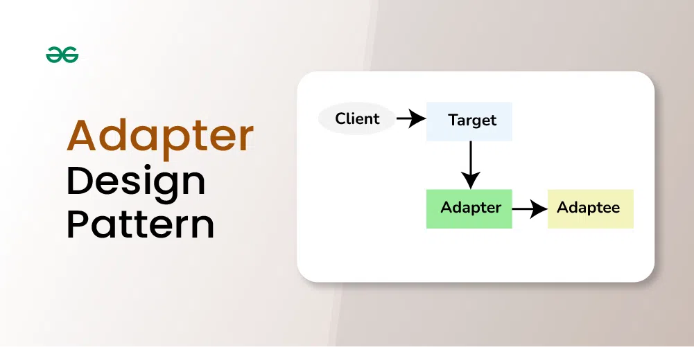
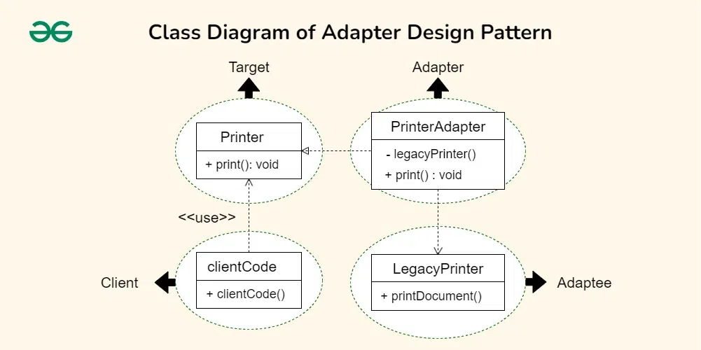

**Adaper Design Pattern**

The Adapter design pattern is a structural pattern that allows the interface of an existing class to be used as another interface. It acts as a bridge between two incompatible interfaces, making them work together. This pattern involves a single class, known as the adapter, which is responsible for joining functionalities of independent or incompatible interfaces.

**Let’s understand this concept using a simple example:**

Let’s say you have two friends, one who speaks only English and another who speaks only French. You want them to communicate, but there’s a language barrier.

- You act as an adapter, translating messages between them. Your role allows the English speaker to convey messages to you, and you convert those messages into French for the other person.
- In this way, despite the language difference, your adaptation enables smooth communication between your friends.
- This role you play is similar to the Adapter design pattern, bridging the gap between incompatible interfaces.

**Components of Adapter Design Pattern:**

**1. Target Interface**

- **Description:** Defines the interface expected by the client. It represents the set of operations that the client code can use.
- **Role:** It’s the common interface that the client code interacts with.

**2. Adaptee**

- **Description:** The existing class or system with an incompatible interface that needs to be integrated into the new system.
- **Role:** It’s the class or system that the client code cannot directly use due to interface mismatches.

**3. Adapter**

- **Description:** A class that implements the target interface and internally uses an instance of the adaptee to make it compatible with the target interface.
- **Role:** It acts as a bridge, adapting the interface of the adaptee to match the target interface.

**4. Client**

- **Description:** The code that uses the target interface to interact with objects. It remains unaware of the specific implementation details of the adaptee and the adapter.
- **Role:** It’s the code that benefits from the integration of the adaptee into the system through the adapter.

**Implementation:**

Let’s consider a scenario where we have an existing system that uses a `LegacyPrinter` class with a method named `printDocument()` which we want to adapt into a new system that expects a `Printer` interface with a method named `print()`. We’ll use the Adapter design pattern to make these two interfaces compatible.

