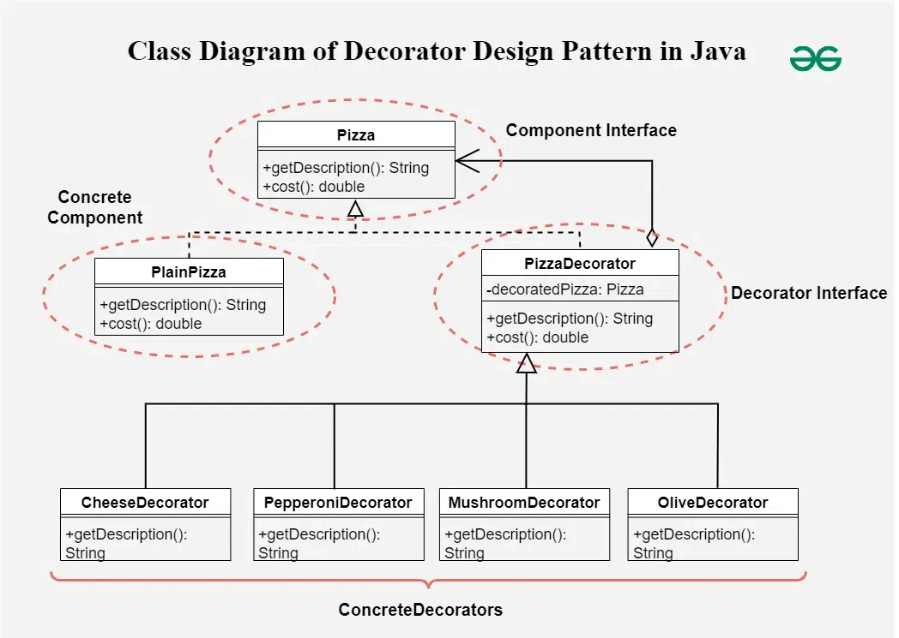

**Decorator Design Pattern**

The Decorator design pattern is a structural pattern used in object-oriented programming to add new functionality to objects dynamically without altering their structure. In Java, this pattern is often employed to extend the behavior of objects in a flexible and reusable way.

It involves creating a set of decorator classes that are used to wrap concrete components.

**Components of Decorator Method Design Pattern in Java**

Below are the components of decorator method design pattern in java:
- `Component Interface`: An interface or abstract class that defines the core functionality. This is the base type for both concrete components and decorators.
- `Concrete Component`: A class that implements the Component interface and provides the basic behavior.
- `Decorator`: An abstract class that implements the Component interface and has a reference to a Component object. This class defines the interface for the decorators and includes a reference to a Component instance.
- `Concrete Decorators`: Classes that extend the Decorator class and add additional behavior to the Component.

**Example of Decorator Method Design Pattern in Java:**
Below is the problem statement to understand decorator method design pattern in Java:

Imagine a pizza shop where customers can customize their pizzas with various toppings like cheese, pepperoni, mushrooms, and olives. The goal is to create a flexible system that allows you to dynamically add any combination of toppings to a base pizza without modifying the existing pizza classes or creating numerous subclasses.

- The Decorator pattern helps solve this problem by allowing you to extend the behavior of a base pizza object dynamically.
- You can create decorators for each topping, which will add its specific functionality to the base pizza.

**Advantages of the Decorator Pattern:**
- `Flexibility`: You can add or remove responsibilities dynamically without modifying existing code.
- `Composability`: You can combine multiple decorators to build complex objects with different behaviors.
- `Adherence to Open/Closed Principle`: The pattern allows you to extend functionality without modifying existing code.

**When to Use:**
- When you want to add responsibilities to individual objects dynamically and transparently.
- When subclassing is impractical or leads to an explosion of subclasses.

In this way, the Decorator Pattern allows you to create flexible, modular, and reusable designs, where behavior can be added or modified dynamically.