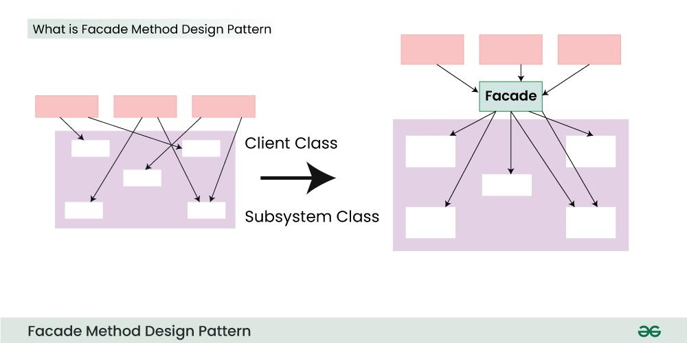

**Facade Design Pattern**

Facade Method Design Pattern is a `Structural design patterns`. Before we dive deep into the details of it, imagine a building, the facade is the outer wall that people see, but behind it is a complex network of wires, pipes, and other systems that make the building function. The facade pattern is like that outer wall. It hides the complexity of the underlying system and provides a simple interface that clients can use to interact with the system.

The Facade Design Pattern is a structural pattern that provides a simplified interface to a complex subsystem. It hides the complexities of the system and provides a unified, high-level interface that is easier to use. The purpose of this pattern is to make a system easier to use by allowing the client to interact with a simple interface rather than dealing with many intricate parts of a system directly.

**Key Concepts of the Facade Pattern:**

1. **Facade**: The class that provides a simplified interface to the complex subsystems.
2. **Subsystems**: The complex classes or interfaces that the facade simplifies. The facade interacts with these subsystems on behalf of the client.
3. **Client**: The code that uses the facade to access the functionalities of the subsystems.

**When to Use the Facade Pattern:**

- When you want to provide a simple interface to a complex system.
- When there are many subsystems that the client code needs to interact with directly.
- When you want to decouple the client from the subsystem to reduce dependency.

**Example:**
Consider an example of a home theater system, which consists of various subsystems like a DVD player, projector, sound system, lights, etc. The user has to manually control each component. By using the Facade Pattern, we can create a simple interface for the user to turn on the entire system with a single method.

**When to Avoid:**
- When the system is simple, and adding a facade would add unnecessary complexity.
- When clients need full control of the subsystems without restrictions imposed by the facade.

**Use Cases of the Facade Pattern:**
- **GUI systems**: A facade can simplify interaction with different components like buttons, text fields, etc.
- **Database connections**: A facade can simplify interactions with a complex database system, hiding connection, query execution, and result fetching behind a simple interface.
- **Networking libraries**: A facade can simplify complex network operations by providing methods like `connect()`, `send()`, `disconnect()`.